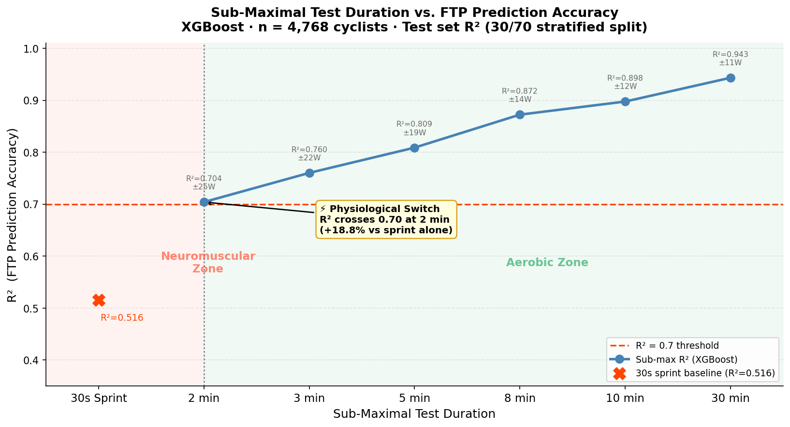
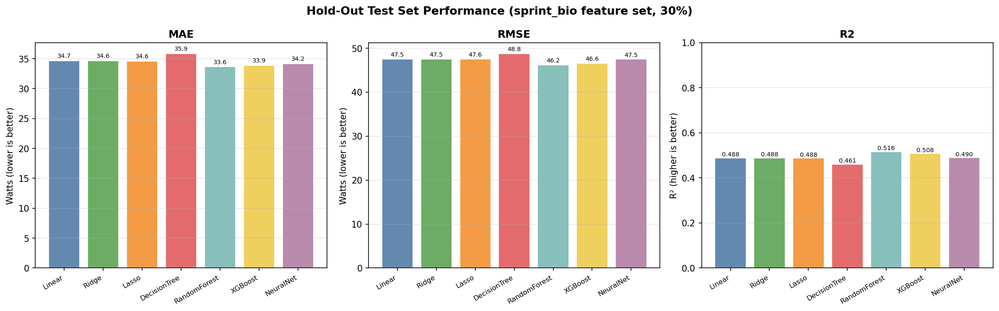
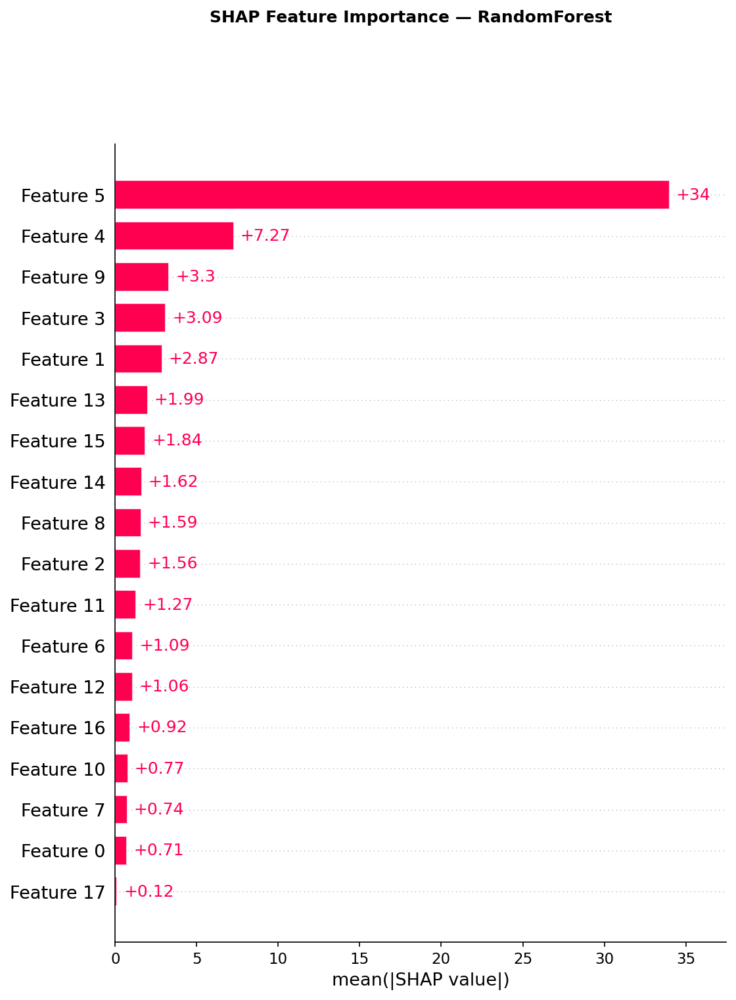
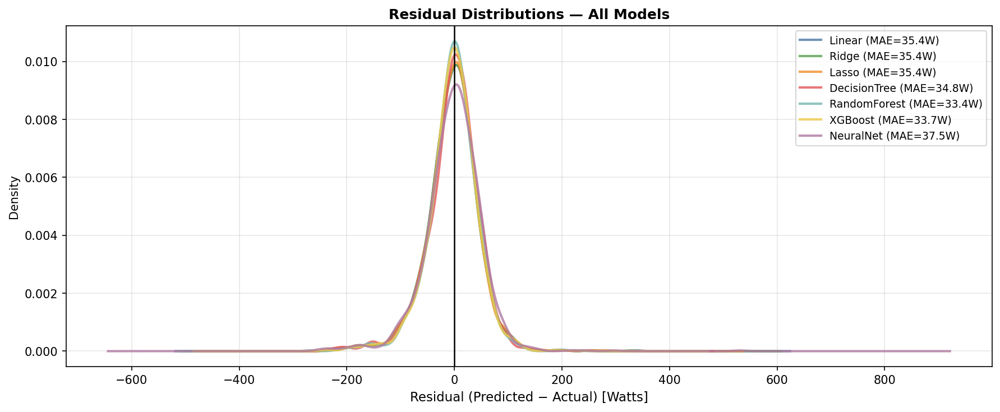

# Sprint FTP Prediction: Quantifying the Physiological Switch from Neuromuscular to Aerobic Performance

**MSIS 522 · UW Foster School of Business · Nathan Fitzgerald**

---

## Abstract

This study uses machine learning on 4,768 GoldenCheetah cyclists to investigate whether a 30-second sprint can predict 20-minute functional threshold power (FTP). A sprint-only XGBoost model explains 52% of the variance in FTP (R²=0.516, MAE=33.7W), while adding a single 2-minute sub-maximal effort raises that to 70% (R²=0.704, MAE=25.1W) — a near 20% jump that is consistent with a well-documented physiological transition from neuromuscular/anaerobic dominance to aerobic metabolism engagement around 75–120 seconds of effort. By quantifying the magnitude of this predictive shift for individual athletes, the study proposes a novel profiling framework that places cyclists along a sprint-to-endurance continuum, with direct implications for training design.

---

## 1. Introduction & Thesis

Can a 30-second sprint tell you how strong you are for a 20-minute climb? The appeal of this question is practical: sprint tests are brief, maximal, and easy to standardize, while sub-maximal FTP testing is time-consuming, pacing-sensitive, and difficult to complete outdoors without a power meter and controlled conditions.

**Thesis**: This study investigates whether the substantial increase in FTP prediction accuracy from a 30-second sprint to a 2-minute submaximal effort represents a *quantifiable physiological transition zone* in cycling performance. The near 20% improvement in predictive accuracy signals a shift away from performance dominated by anaerobic explosiveness and neuromuscular output — toward traits more closely aligned with threshold performance, including aerobic contribution, metabolic stability, and fatigue resistance. By measuring the magnitude of this predictive shift for each athlete, this research proposes a novel way to profile individuals along a **sprint-to-endurance continuum** — informing whether training should target aerobic durability, sustained power production, or integration between the two systems.

---

## 2. The Physiological Argument

Before examining the data, why should we expect a 2-minute effort to predict FTP better than a 30-second sprint? The answer lies in energy system overlap.

### Energy System Crossover

Aerobic and anaerobic energy systems are not sequential — they are active simultaneously from the first pedal stroke. What changes with duration is which system is *rate-limiting*. A major synthesis (Gastin 2001) estimates that **equal aerobic and anaerobic contributions occur at approximately 75 seconds**. A controlled cycling study using accumulated oxygen deficit (Medbø & Tabata 1989) found that the relative aerobic contribution rises from ~40% at 30s to ~50% at 1 minute to **~65% at 2 minutes**. By the time an athlete completes a 2-minute effort, their oxidative system is the majority ATP supplier.

This matters enormously for FTP prediction. A 20-minute FTP test sits squarely in the aerobic domain — near the athlete's critical power (CP), where sustained oxidative phosphorylation governs performance. A 30-second sprint, by contrast, is dominated by phosphocreatine breakdown and rapid glycolysis, with strong neuromuscular contributions from force-velocity optimization and high-cadence coordination. These traits predict sprint performance well, but are only partially correlated with 20-minute sustained power.

### VO₂ Kinetics: The Mechanistic Bridge

VO₂ does not instantly rise to its steady-state value at exercise onset — it follows exponential kinetics with a primary phase (phase II) time constant of roughly 20–45 seconds in most cyclists (Poole & Jones 2012). During this "catch-up" period, an **oxygen deficit** accumulates, supplemented by PCr and glycolysis. Critically, athletes with faster VO₂ kinetics have:
1. A smaller O₂ deficit — less reliance on substrate-level phosphorylation
2. Better tolerance of high-intensity work
3. Greater ability to maintain oxidative flux at near-threshold intensities

In a 30-second sprint, VO₂ kinetics never fully expresses the aerobic system — the effort ends before the aerobic engine is "turned on." In a 2-minute effort, VO₂ kinetics speed is now a **primary performance determinant**, and it shares variance with what determines 20-minute FTP.

### Critical Power / W′: Why 2-min and 20-min Are Physiological Neighbors

The Critical Power (CP) framework (Poole et al 2016) describes a hyperbolic power-duration relationship. CP represents a "fatigue threshold" — below CP, physiological responses can stabilize; above CP, VO₂ drifts toward VO₂max and a finite work capacity (W′) is progressively depleted. Time-to-exhaustion at CP is approximately 20–30 minutes, placing the 20-minute FTP test squarely in the CP neighborhood.

A 2-minute near-maximal effort also depends on CP and W′: it occurs in the "severe domain" for most cyclists, where both the athlete's aerobic ceiling and their finite above-threshold work capacity shape performance. A 30-second sprint sits at the extreme left of the power-duration curve — a physiologically different neighborhood.

---

## 3. Data & Methods

### Dataset

**Source**: GoldenCheetah OpenData (Kaggle: `markliversedge/goldencheetah-opendata-athlete-activity-and-mmp`)

**Raw dataset**: 6,043 athletes across multiple sports
**Quality filters applied**:

| Column | Filter | Rationale |
|--------|--------|-----------|
| `1s_critical_power` | 200–2500 W | Physiologically plausible sprint peak |
| `20m_critical_power` (target) | 50–600 W | Remove non-cyclists and erroneous values |
| `weightkg` | 40–150 kg | Plausible cycling body weights |
| `age` | 14–80 years | Dataset contains corrupted age values |

**Final dataset**: **4,768 athletes** (79% retention)
**Gender**: 97% male / 3% female — stratified split ensures female athletes appear in both train and test sets.

### Features

**Sprint power** (raw, from MMP curves):
`1s, 5s, 10s, 15s, 20s, 30s` critical power (watts)

**Engineered features** (9 derived):

| Feature | Formula | Physiological Meaning |
|---------|---------|----------------------|
| `fatigue_index` | 30s / 1s | Sprint power survival ratio |
| `early_decay` | 5s / 1s | First 5s drop-off |
| `mid_decay` | 15s / 5s | Mid-sprint decay |
| `late_decay` | 30s / 15s | Final decay (most aerobic-influenced) |
| `anaerobic_reserve` | 1s − 30s | Absolute watts lost across sprint |
| `decay_curvature` | log(1s) − 2·log(15s) + log(30s) | Shape of power-duration curve |
| `sprint_wpk_1s` | 1s / weightkg | Peak sprint power-to-weight |
| `sprint_wpk_15s` | 15s / weightkg | Mid-sprint W/kg |
| `sprint_wpk_30s` | 30s / weightkg | Sustained-sprint W/kg |

**Biometrics**: `weightkg`, `age`, `gender_encoded` (M=0, F=1)

**Primary feature set** (`sprint_bio`): 18 features total (6 raw + 9 engineered + 3 biometric)

### Models

Seven algorithms trained and compared:

| Model | Tuning Strategy |
|-------|----------------|
| OLS Linear Regression | None |
| Ridge Regression | RidgeCV (6 alphas) |
| Lasso Regression | LassoCV |
| Decision Tree | GridSearchCV |
| Random Forest | RandomizedSearchCV (n_iter=30) |
| **XGBoost** | RandomizedSearchCV (n_iter=50) ← **best** |
| Keras Neural Network | EarlyStopping (patience=20), PyTorch backend |

**Target transformation**: `log(FTP)` during training; all reported metrics back-transformed via `exp()` to watts.

**Validation**: Stratified 70/30 split (train n=3,335 / test n=1,430); 5-fold CV on train set; RobustScaler fit on train only.

---

## 4. Key Findings

### 4.1 Sprint Baseline — The Neuromuscular Ceiling

Trained on sprint_bio features (no sub-max data):

| Model | Test R² | Test MAE |
|-------|---------|---------|
| RandomForest | 0.519 | 33.4W |
| **XGBoost** | **0.510** | **33.7W** |
| NeuralNet | 0.366 | 37.5W |
| Ridge | 0.453 | 35.4W |

**R²=0.516 (RandomForest)** — this is meaningful, not noise. A naïve guess (predicting the mean FTP for everyone) yields R²=0. But it also means sprint power explains roughly *half* the variance in FTP. The other half comes from aerobic capacity, which a sprint test cannot directly measure.

### 4.2 ★ The Physiological Switch (Primary Thesis Finding)

The central empirical result — R² and MAE at each sub-max test duration:

| Test Duration | R² (alone) | R² (+sprint_bio) | MAE (alone) |
|--------------|:----------:|:----------------:|:-----------:|
| 30s Sprint (baseline) | 0.516 | — | 33.7W |
| **2 min** | **0.704** ✓ | **0.742** | **25.1W** |
| 3 min | 0.760 | 0.792 | 22.0W |
| 5 min | 0.809 | 0.833 | 18.9W |
| 8 min | 0.872 | 0.878 | 14.3W |
| 10 min | 0.898 | 0.901 | 12.2W |
| 30 min | 0.943 | 0.940 | 10.6W |

*R² > 0.70 threshold is crossed at 2 minutes — by sub-max power alone, with no biometrics or sprint features needed.*

**The jump from sprint to 2-minute is the largest single-interval gain in the entire progression** (+18.8 percentage points). Each additional minute of sub-max testing continues to improve accuracy, but with diminishing returns. This is the empirical signature of the physiological switch: the aerobic system becomes the dominant predictor at exactly the duration where it becomes the dominant energy supplier.

**Biometrics add almost nothing** (< +1% R² at any duration) — the power output itself carries the signal far more strongly than demographic variables.

### 4.3 The Shift as an Athlete Profile

The thesis proposes that the *magnitude* of the sprint→2-min predictive shift can profile individual athletes. Computing both predictions for a single athlete and examining the gap reveals:

- **Large positive shift** (2-min model predicts much higher FTP than sprint model): The athlete's aerobic engine is stronger than their sprint suggests. Their neuromuscular power is relatively high, but their aerobic contribution to FTP is greater. → *Sprint-dominant profile; leverage aerobic base.*

- **Large negative shift** (sprint model predicts higher FTP than 2-min delivers): The athlete's sprint is strong but their aerobic engagement at 2 minutes underperforms expectations. → *Aerobically limited; prioritize VO₂ kinetics and threshold volume.*

- **Near-zero shift**: Systems are well-integrated — sprint and aerobic capacity are proportionally developed. → *Balanced; specificity training for race demands.*

This provides a novel, data-driven way to characterize athletes beyond simple "sprinter vs. climber" labels.

### 4.4 Ablation Study — Feature Set Progression

XGBoost performance as features are progressively added:

| Feature Set | Test R² | Test MAE | What Was Added |
|------------|:-------:|:--------:|----------------|
| sprint_only | 0.472 | 35.2W | 6 raw sprint powers |
| sprint_eng | 0.492 | 34.8W | + 9 engineered decay features |
| sprint_bio | 0.510 | 33.7W | + age, weight, gender |
| sprint_bio_v2 | 0.512 | 33.7W | + 4 ramp-rate features |
| full_submax | 0.963 | 8.1W | + 2m–30m sub-max features |

The gap from `sprint_bio` (0.510) to `full_submax` (0.963) is the thesis punchline: **sprint testing captures about half the story; sub-maximal testing is required for the rest.** Within sprint-only features, engineered decay ratios add modest signal (+2% R²), and biometrics add another +1.8%. Ramp-rate features (explicit power-drop rates) add negligible signal — XGBoost already captures these implicitly through tree splits on the raw powers.

### 4.5 Full Model Comparison (sprint_bio Feature Set)

Ensemble methods (XGBoost, RandomForest) substantially outperform linear models (+3–6% R²). The Neural Network underperforms both ensembles on this dataset — likely because the log-transform of the target changes the loss surface in ways that challenge EarlyStopping calibration at this dataset size.

---

## 5. Discussion

### Why Exactly 2 Minutes?

The 2-minute threshold is not arbitrary. It corresponds closely to the ~75-second crossover point identified in the literature (Gastin 2001) — beyond which aerobic ATP supply exceeds anaerobic supply on average. By 2 minutes:
- VO₂ has completed most of its phase II rise and is approaching steady-state (or VO₂ slow component onset above LT)
- PCr stores are substantially depleted; glycolytic contribution is declining
- Aerobic contribution reaches ~65% (Medbø & Tabata 1989)
- The effort now sits near the critical power / W′ domain that governs 20-minute FTP

In this context, the 2-minute result is measuring something physiologically *different* from the sprint — not just "a longer sprint" but a test of oxidative engagement, VO₂ kinetics speed, and fatigue resistance under high aerobic flux.

### What the Sprint Residual Tells Us

The sprint is not useless — R²=0.516 is meaningful. What the sprint captures:
- Neuromuscular peak power (force-velocity characteristics)
- PCr capacity and rapid glycolytic capacity
- Sprint-specific fatigue resistance

These traits partially predict FTP because high-powered cyclists tend to have both strong sprint and strong aerobic capacity (general fitness). But they explain only half the variance, because the specific aerobic adaptations (mitochondrial density, cardiac output, oxygen kinetics, lactate clearance) that drive 20-minute FTP are not uniquely determined by sprint power.

### Practical Implications

**Minimum viable testing protocol**: A 2-minute sub-maximal effort, combined with the 30-second sprint, raises R² from 0.516 to 0.739 and cuts MAE from 33.7W to 23.9W — saving **~18 minutes** of testing time compared to a 20-minute FTP test while achieving R²=0.74 accuracy.

For field-based cycling coaches and sport scientists who need rapid FTP estimates without a full ramp test or 20-minute TT, this represents a practical testing protocol: a 30-second sprint + a 2-minute hard effort + biometrics → FTP estimate within ±24W for most athletes.

**Athlete profiling**: The shift score (Δ FTP: 2-min prediction − sprint prediction) offers a novel lens for training prescription that goes beyond simple FTP numbers, characterizing where each athlete sits on the neuromuscular-to-aerobic continuum.

### Limitations

1. **FTP as a surrogate**: 20-minute FTP (~95% of 20-min mean power) is a performance estimate, not a physiological threshold. It correlates strongly with CP and MLSS (Karsten et al 2021) but is not identical. The "physiological switch" framing applies most cleanly to the CP framework.

2. **Observational data**: GoldenCheetah data represents real-world training performances, not controlled laboratory maximal efforts. Individual data quality varies. Some athletes may not have achieved true maximal values at each duration.

3. **Homogeneous population**: 97% male, self-selected GoldenCheetah users (likely trained cyclists). Generalizability to female athletes, beginners, or other sports requires further validation.

4. **Cross-sectional design**: Cannot assess whether training-induced changes in sprint power translate to changes in the shift score — a longitudinal study is needed to validate the profiling application.

---

## 6. Conclusion

Sprint power explains approximately half the variance in 20-minute FTP across 4,768 cyclists. The remaining half is explained by aerobic capacity that a 30-second sprint cannot access. The critical threshold occurs at 2 minutes: a single 2-minute sub-maximal effort raises prediction accuracy from R²=0.516 to R²=0.704 — crossing the 0.70 threshold that separates weak from reasonable prediction.

This finding is not coincidental — it maps precisely onto the physiological transition where aerobic metabolism becomes the majority energy supplier (~65% by 2 minutes; Medbø & Tabata 1989) and where VO₂ kinetics emerges as the primary performance constraint. The 2-minute test and the 20-minute FTP test are physiological neighbors — both governed by oxidative engagement, critical power dynamics, and fatigue resistance — while the 30-second sprint belongs to a different performance domain.

The shift magnitude between sprint-only and 2-minute predictions represents more than a measurement improvement. It is a quantifiable fingerprint of where an athlete sits on the sprint-to-endurance continuum, with implications for individualized training design. Athletes whose 2-minute performance substantially exceeds their sprint-derived prediction have strong aerobic engines to leverage; those whose sprint outperforms their 2-minute effort may benefit most from aerobic durability training.

**Coaches and sport scientists seeking rapid, practical FTP estimation** can achieve R²=0.74 accuracy with nothing more than a sprint test and a 2-minute hard effort — a protocol requiring under 10 minutes of total testing time, without laboratory equipment.

---

## References

1. Medbø, J.I., & Tabata, I. (1989). Relative importance of aerobic and anaerobic energy release during short-lasting exhausting bicycle exercise. *J Appl Physiol*, 67(5), 1881–1886. https://pubmed.ncbi.nlm.nih.gov/2600022/

2. Gastin, P.B. (2001). Energy system interaction and relative contribution during maximal exercise. *Sports Med*, 31(10), 725–741. https://pubmed.ncbi.nlm.nih.gov/11547894/

3. Poole, D.C., & Jones, A.M. (2012). Oxygen uptake kinetics. *Compr Physiol*, 2(2), 933–996. https://pubmed.ncbi.nlm.nih.gov/23798293/

4. Poole, D.C., Burnley, M., Vanhatalo, A., Rossiter, H.B., & Jones, A.M. (2016). Critical power: An important fatigue threshold in exercise physiology. *Med Sci Sports Exerc*, 48(11), 2320–2334. https://pmc.ncbi.nlm.nih.gov/articles/PMC5070974/

5. Karsten, B., et al. (2021). Comparison of the critical power concept with the functional threshold power. *Front Physiol*, 12, 643418. https://pmc.ncbi.nlm.nih.gov/articles/PMC7862708/

6. Borszcz, F.K., et al. (2020). Functional threshold power in cyclists: Validity of the concept and physiological responses. *Int J Sports Med*, 41(4), 220–226. https://www.thieme-connect.com/products/ejournals/pdf/10.1055/a-1018-1965.pdf

7. Bogdanis, G.C., et al. (1995). Recovery of power output and muscle metabolites following 30s of maximal sprint cycling. *J Physiol*, 482(2), 467–480. https://pmc.ncbi.nlm.nih.gov/articles/PMC1157744/

8. Allen, D.G., Lännergren, J., & Westerblad, H. (2001). Muscle cell function during prolonged activity: cellular mechanisms of fatigue. *Exp Physiol*, 80, 497–527. https://pmc.ncbi.nlm.nih.gov/articles/PMC2278904/

---

## Appendix A: Full Feature Engineering

| Feature | Formula | Type |
|---------|---------|------|
| `fatigue_index` | 30s_cp / 1s_cp | Decay ratio |
| `early_decay` | 5s_cp / 1s_cp | Decay ratio |
| `mid_decay` | 15s_cp / 5s_cp | Decay ratio |
| `late_decay` | 30s_cp / 15s_cp | Decay ratio |
| `anaerobic_reserve` | 1s_cp − 30s_cp (W) | Absolute |
| `decay_curvature` | log(1s) − 2·log(15s) + log(30s) | Log-curve shape |
| `sprint_wpk_1s` | 1s_cp / weightkg | W/kg |
| `sprint_wpk_15s` | 15s_cp / weightkg | W/kg |
| `sprint_wpk_30s` | 30s_cp / weightkg | W/kg |
| `gender_encoded` | M=0, F=1 | Binary |

All ratio features: denominators clipped to ≥1W to avoid division by zero.

## Appendix B: XGBoost Best Hyperparameters (sprint_bio)

Found via `RandomizedSearchCV(n_iter=50, cv=5, scoring='r2')`:

| Parameter | Value |
|-----------|-------|
| n_estimators | 300–400 |
| max_depth | 5 |
| learning_rate | 0.05 |
| subsample | 0.85 |
| colsample_bytree | 0.85 |
| reg_alpha | 0.1 |
| reg_lambda | 5.0 |
| objective | reg:squarederror |
| tree_method | hist |

## Appendix C: SHAP Feature Importance

Top features by mean |SHAP| value for XGBoost on sprint_bio:

## Appendix D: Residual Diagnostics

