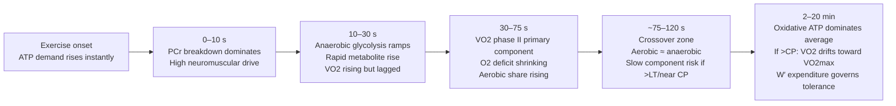

# Physiological and Kinesiological Mechanisms Explaining Why a 2‑Minute Sub‑Max Effort Predicts 20‑Minute FTP Better Than a 30‑Second Sprint

## Executive summary

Your “physiological switch” hypothesis is strongly consistent with established exercise physiology: as test duration extends from **~30 s** to **~2 min**, the **dominant performance constraints shift** from **neuromuscular power + rapid substrate‑level phosphorylation (PCr + anaerobic glycolysis)** toward **oxidative metabolism engagement, VO₂ kinetics, and fatigue‑resistance under high aerobic flux**. This matters because **20‑min FTP/TT power** (even if not a perfect physiological threshold) is largely governed by **oxidative steady‑state capacity and the power–duration curve near critical power**, not by peak sprint mechanical power. citeturn4view0turn19view0turn11view0turn14view0

Direct evidence supports a “crossover” occurring around ~1–2 minutes: a classic cycling study using accumulated O₂ deficit reported that the **relative aerobic contribution rises from ~40% at ~30 s**, to **~50% at ~1 min**, to **~65% for exercise lasting ~2 min**. citeturn19view0 A major review likewise concludes that **equal aerobic vs anaerobic contributions occur around ~75 s** (earlier than many coaching heuristics suggest). citeturn4view0 Together, these map cleanly onto your observation that a **2‑min effort shares more variance** with a **20‑min FTP proxy** than a **30‑s sprint** (R² 0.704 vs 0.516 in your dataset). citeturn19view0turn4view0turn11view0turn14view0

Mechanistically, the 2‑min test “loads” systems that also govern 20‑min performance: **fast VO₂ kinetics (smaller O₂ deficit), sustainable high oxidative ATP turnover, loss of efficiency/VO₂ slow component behavior, and the balance between critical power and the finite work capacity above it (W′)**. In contrast, 30‑s sprint outcomes are heavily shaped by **force–velocity constraints, coordination at high cadence, and glycolytic/PCr‑linked fatigue**, which are only partially related to 20‑min FTP. citeturn8view0turn34view0turn11view0turn28view0

## Evidence approach and source prioritization

This report prioritizes (1) **primary cycling energetics papers** that quantify aerobic vs anaerobic contributions over 30 s–3 min using oxygen uptake/oxygen deficit and (in some cases) muscle metabolites; (2) **VO₂ kinetics** reviews and primary training‑adaptation studies addressing oxygen deficit and phase II kinetics; (3) **critical power (CP) and power–duration** framework papers and reviews tying intensity domains to metabolic stability; (4) **FTP validity and reliability** studies clarifying what 20‑min FTP does and does not represent physiologically; and (5) **cellular fatigue mechanism** reviews/papers focusing on inorganic phosphate, Ca²⁺ handling, acidosis, and ROS/RNS that are duration‑ and intensity‑dependent. citeturn19view0turn8view0turn11view0turn14view0turn21view0turn21view1turn30view0turn12view0turn13view0

### Key citations used in this report

| Topic area | Source (linked) | Why it matters for the “switch” argument |
|---|---|---|
| Aerobic vs anaerobic contribution (30 s → 2 min) | Cycling to exhaustion at ~30 s, ~1 min, ~2–3 min; aerobic fraction rises to ~65% by ~2 min. citeturn19view0 | Quantifies the time‑dependent shift toward oxidative contribution by ~2 min. |
| Energy system interaction “crossover” timing | Review concluding equal aerobic/anaerobic contributions occur ~1–2 min (around ~75 s). citeturn4view0 | Places the switch near ~75 s, supporting why 2‑min is metabolically closer to 20‑min. |
| Aerobic contribution during a 30‑s Wingate | Wingate analysis reporting ~16–24% overall aerobic contribution and ~35% in the last 5 s; VO₂ reaches ~93% VO₂peak by the end. citeturn17view0turn17view1 | Shows 30‑s is not “pure anaerobic,” but still dominated by sprint‑specific constraints. |
| Muscle metabolite profile after 30‑s sprint | 30‑s sprint leaves PCr ~20% of rest and pH ~6.7, with high muscle lactate; PCr resynthesis half‑time ~57 s. citeturn6view0 | Anchors the strong peripheral metabolic disturbance typical of sprint‑dominant tests. |
| VO₂ kinetics, oxygen deficit, tolerance | Review: faster VO₂ kinetics → smaller O₂ deficit, less reliance on substrate‑level phosphorylation, better tolerance. citeturn8view0 | Mechanistic bridge for why ~2‑min performance reflects aerobic system “engagement speed.” |
| VO₂ slow component & type II fiber recruitment | Review: above LT, VO₂ kinetics includes a slow component; recruitment of low‑efficiency type II fibers is a plausible contributor. citeturn34view0 | Links fatigue/efficiency loss in 2‑min efforts to fiber recruitment dynamics relevant to sustained power. |
| Critical power as fatigue threshold | CP separates intensity domains where responses can/cannot stabilize; above CP VO₂ rises toward VO₂max and W′ is expended. citeturn11view0 | Establishes CP/W′ as a coherent model for understanding 2‑min vs 20‑min linkage. |
| CP model and W′ metabolites | Review: CP associated with maximal aerobic steady state; W′ linked to metabolite accumulation (Pi, H⁺). citeturn28view1 | Explains how short severe efforts depend on both aerobic ceiling (CP) and metabolite tolerance (W′). |
| CP vs FTP agreement and limits | Study: CP and FTP strongly correlate (r≈0.97) but LoA wide; advises not interchangeable. citeturn14view0 | Supports why 20‑min FTP relates to CP physiology, but with practical/measurement caveats. |
| FTP reliability and definition in practice | FTP20 protocol reliability: 20‑min TT CV ~2.9%, ICC ~0.97; FTP defined as ~1‑h quasi‑steady power, estimated as 95% of 20‑min mean. citeturn30view0turn30view1 | Clarifies what 20‑min FTP is measuring and how repeatable it can be. |
| FTP vs MLSS validity debate | One study: FTP correlates strongly with MLSS; others show systematic differences and poor sensitivity to training changes. citeturn12view0turn13view0 | Frames FTP as a performance surrogate—useful, but not identical to a physiological threshold. |
| Pi, Ca²⁺ handling, fatigue mechanisms | Review: Pi rises substantially (to ~30–40 mM) in intense contraction and can impair SR Ca²⁺ release via Ca‑Pi precipitation. citeturn21view0 | Mechanistic explanation for rapid power loss in short severe/sprint tests. |
| Acidosis, Pi, ROS/RNS fatigue roles | Review: acidosis has limited effect on SR Ca²⁺ release in acute fatigue; elevated Pi and ROS/RNS contribute in intensity‑dependent ways. citeturn21view1turn22view1 | Refines “lactate vs fatigue” narratives and explains duration‑dependent fatigue drivers. |

For convenience, direct links to several high‑load sources (also accessible via the citations above) are listed here:

```text
Medbø & Tabata 1989 (PubMed): https://pubmed.ncbi.nlm.nih.gov/2600022/
Gastin 2001 (PubMed): https://pubmed.ncbi.nlm.nih.gov/11547894/
Poole & Jones 2012 VO2 kinetics (PubMed): https://pubmed.ncbi.nlm.nih.gov/23798293/
Poole et al 2016 Critical Power (PMC): https://pmc.ncbi.nlm.nih.gov/articles/PMC5070974/
Karsten et al 2021 CP vs FTP (PMC): https://pmc.ncbi.nlm.nih.gov/articles/PMC7862708/
Borszcz et al 2020 FTP reliability (PDF): https://www.thieme-connect.com/products/ejournals/pdf/10.1055/a-1018-1965.pdf
Bogdanis et al 1995 30-s sprint metabolites (PMC): https://pmc.ncbi.nlm.nih.gov/articles/PMC1157744/
Allen et al 2001 phosphate & fatigue (PMC): https://pmc.ncbi.nlm.nih.gov/articles/PMC2278904/
Cheng et al 2018 Ca2+ handling & fatigue (PMC): https://pmc.ncbi.nlm.nih.gov/articles/PMC5793735/
```

## Energy-system contributions and VO₂ kinetics across durations

### Energy-system contributions across time windows

A key correction to “textbook” coaching narratives is that energy systems do not operate sequentially; instead, they are **integrated from the onset** of work. What changes with duration is **which system is rate‑limiting and which fatigue mechanisms dominate**. citeturn4view0turn8view0

| Time domain | Expected energy-system pattern | Practical implication for predicting 20‑min FTP |
|---|---|---|
| 0–30 s | Very high ATP turnover is buffered primarily by **PCr breakdown** and **rapid glycolysis**, while **oxidative phosphorylation ramps quickly** (and can be non-trivial even by 30 s). citeturn4view0turn17view0turn17view1turn19view0turn6view0 | Sprint power is strongly influenced by neuromuscular and anaerobic traits that are *not* the main limit of 20‑min power. citeturn28view0turn11view0 |
| 30–120 s | **Aerobic fraction rises rapidly** as VO₂ kinetics “catches up,” shrinking oxygen deficit; around ~75 s, aerobic and anaerobic contributions can be roughly similar, and by ~2 min aerobic is often the majority. citeturn4view0turn19view0turn8view0 | Now the test begins to express the athlete’s **oxidative engagement speed** and **high-power metabolic stability**, which overlap more with FTP physiology. citeturn8view0turn34view0turn11view0 |
| 2–20 min | For hard constant efforts near CP/FTP, **oxidative phosphorylation dominates average ATP supply**, while a finite “above-threshold” contribution (often conceptualized as W′) can be spent early and during surges; above CP, VO₂ and lactate may not stabilize. citeturn11view0turn28view1turn14view0turn30view0 | A 2‑min test sits much closer on the same power–duration curve neighborhood as a 20‑min TT, and depends more on CP‑related traits than sprint‑only traits. citeturn11view0turn14view0turn19view0 |

### Quantitative anchors: why 2 minutes is not “just longer sprinting”

Two classic lines of evidence bound the “switch”:

* A controlled cycling study using **accumulated O₂ deficit** found that the **relative aerobic contribution** increases sharply with duration: about **40% at ~30 s**, **50% at ~1 min**, and **~65% by ~2 min**. citeturn19view0  
* A widely used 30‑s Wingate analysis estimated the **overall aerobic contribution** at about **16–24%** (method‑dependent) but noted that **aerobic contribution rises across the 30 s**, reaching about **35% in the final 5 s**, with VO₂ reaching about **93% of VO₂peak** by the end of the test. citeturn17view0turn17view1

These two results are not contradictory: they use **different models/assumptions** (oxygen deficit vs oxygen uptake/efficiency) and different protocols (constant-power to exhaustion vs Wingate-like dynamics), but both support the same thesis-relevant claim—**by ~2 minutes, aerobic metabolism is typically the majority contributor**, so the test becomes more reflective of aerobic engagement and sustainable metabolism than a short sprint is. citeturn19view0turn17view0turn4view0

### VO₂ kinetics and oxygen deficit: the physiological bridge between 2 min and 20 min

The VO₂ response to exercise transitions is governed by **kinetics**, not just maximal capacity. A foundational VO₂ kinetics review states that **faster VO₂ kinetics produces a smaller O₂ deficit**, requiring **less substrate‑level phosphorylation** (PCr/glycolysis) and improving exercise tolerance; slower kinetics increases O₂ deficit and challenges homeostasis. citeturn8view0

This is pivotal for your model because:

* In a **30‑s sprint**, there is insufficient time for VO₂ to “fully express” as the primary ATP supplier, so performance is disproportionately driven by **immediate anaerobic ATP buffering** and the neuromuscular ability to create high power despite rapidly accumulating metabolites. citeturn6view0turn21view0turn28view0  
* In a **2‑min effort**, VO₂ kinetics is now a major constraint: by this point, athletes with faster kinetics and better oxygen delivery/utilization matching will have (i) **reduced oxygen deficit**, (ii) **lower PCr drawdown/less rapid metabolite disruption**, and (iii) greater ability to maintain high power without catastrophic fatigue. citeturn8view0turn19view0turn32view0turn11view0

At intensities above lactate threshold, VO₂ kinetics is more complex due to the **VO₂ slow component**, which can delay steady state or drive VO₂ upward depending on intensity and duration; recruitment of low‑efficiency fast fibers is one plausible contributor. citeturn34view0turn11view0 That matters because **2‑min performance begins to reflect the athlete’s resistance to efficiency loss**—a trait that becomes very relevant to sustaining near‑threshold power for 20 minutes. citeturn34view0turn14view0turn28view1

### Conceptual timeline of the “switch” (systems and VO₂ kinetics)



This flowchart reflects empirically supported landmarks: the ~75 s crossover reported in a major review, and the rapidly rising aerobic fraction by 2 minutes reported in controlled cycling experiments. citeturn4view0turn19view0turn8view0turn34view0turn11view0

## Neuromuscular recruitment and fiber-type roles across durations

### Motor unit recruitment and control strategies shift test “what it measures”

Short, maximal cycling efforts are not just bioenergetic tests; they are also **highly neuromuscular**. A synthesis of sprint cycling physiology emphasizes that maximal cyclical power is constrained by **force–velocity behavior**, **activation–relaxation kinetics**, and **coordination** across cadence, with the influence of each factor depending on movement frequency. citeturn28view0

That framework implies:

* A **30‑s sprint** expresses a large amount of variance from **high-cadence coordination and force–velocity optimization**, which is partly orthogonal to the determinants of sustained 20‑min power. citeturn28view0turn17view0  
* A **2‑min effort** still requires high recruitment and coordination, but the performance outcome increasingly reflects whether the athlete can maintain high power as fatigue develops and oxidative support becomes dominant—i.e., it begins to test “high-power fatigue resistance,” not just “max power.” citeturn19view0turn11view0turn34view0

### Fast vs slow fiber roles and why “IIx vs IIa vs I” matters more at 2 min than 30 s

Muscle fiber types differ in contractile and metabolic characteristics; however, a key nuance is that fiber classification (by myosin heavy chain isoform) does not perfectly map onto oxidative capacity in every context. Still, broad patterns hold: one review concludes that, in general, **type IIX/IIB fibers have relatively low oxidative capacity compared with type I**, while type I and IIA can both have substantial oxidative capacity relative to IIX/IIB. citeturn35view0

Applying that to your durations:

* **30 s sprint**: performance is strongly influenced by the ability to produce very high power quickly, which draws heavily on fast motor units and fibers operating at high shortening velocities, and is limited by rapid fatigue mechanisms that impair force and activation. citeturn28view0turn21view0turn6view0  
* **2 min severe/sub‑max**: the athlete still recruits high‑threshold units, but the winning trait becomes the ability for those fibers (especially fast oxidative‑glycolytic populations) to sustain force production while oxidative metabolism supports ATP resynthesis and limits metabolite disruption. This is also where VO₂ slow component behavior (in part associated with less efficient fast‑fiber recruitment) becomes a meaningful determinant. citeturn19view0turn34view0turn11view0  
* **20 min FTP/TT power**: performance depends far more on the integrated system that supports near‑steady oxidative flux (mitochondrial capacity, oxygen delivery/utilization matching, and the power–duration relationship near CP) than on maximal shortening velocity. citeturn11view0turn28view1turn14view0turn32view0

In short, the 2‑min test is long enough that fiber-type *metabolic* properties (oxidative support, fatigue resistance, efficiency) begin to dominate relative to fiber-type *mechanical* properties (max velocity/power) that dominate very short sprints. citeturn19view0turn28view0turn35view0

## Metabolite accumulation and fatigue mechanisms shaping duration-specific performance

### Why fatigue mechanisms in 30 s are not the same ones that limit 20 min

A 30‑s sprint can produce profound metabolic disturbance. In a classic muscle biopsy study of 30‑s maximal sprint cycling, end-sprint values included **PCr ~19.7% of rest**, **muscle pH ~6.72**, and very high muscle lactate. citeturn6view0 These data illustrate that 30‑s sprint performance is tightly coupled to mechanisms that tolerate or delay severe peripheral disturbance, especially in the first ~10–15 s when PCr availability supports high power. citeturn5view0turn6view0turn21view0

### Inorganic phosphate (Pi), Ca²⁺ handling, and sprint-like fatigue

A mechanistic review focused on phosphate argues that **myoplasmic Pi increases substantially during fatigue**, influences both myofibrillar proteins and activation processes, and can contribute to reduced SR Ca²⁺ release—potentially via Pi entry into SR and Ca‑Pi precipitation that reduces releasable Ca²⁺. citeturn21view0 The same review notes that resting Pi is low (on the order of a few mM) but can rise dramatically (reported up to ~30–40 mM during intense contraction), consistent with Pi being a major candidate mediator of acute high-intensity fatigue. citeturn21view0

This matters for your regression interpretation because:

* A **30‑s sprint** is highly sensitive to acute disruptions in excitation–contraction coupling and force generation that occur rapidly with PCr breakdown and Pi accumulation. citeturn21view0turn6view0turn28view0  
* A **2‑min effort** still experiences these disruptions, but also strongly depends on how quickly oxidative phosphorylation reduces reliance on substrate-level phosphorylation (less PCr drawdown), and how effectively the athlete sustains Ca²⁺ handling and contractile efficiency as intensity remains high. citeturn8view0turn34view0turn11view0

### Hydrogen ions, lactate, and what lactate actually indicates

Two important clarifications for thesis writing:

* A broad fatigue review argues that the “traditional” explanation—**lactate and H⁺ accumulation directly impairing contractile proteins**—is likely of **limited importance in mammals**, shifting attention to ionic changes, SR Ca²⁺ release failure, and ROS-related mechanisms. citeturn9view0  
* A biochemical review specifically argues that there is **no biochemical support for lactate production causing acidosis**, and that lactate production may retard (not cause) acidosis. citeturn20search2

So lactate is best treated in your model as a **marker of glycolytic flux and metabolic stress**, not a direct causal toxin in isolation. citeturn20search2turn9view0 In longer high-intensity contexts, lactate is also a metabolite that can be **shuttled and oxidized** and can act as a fuel and signaling molecule under aerobic conditions. citeturn20search22turn20search14

### ROS/RNS: more relevant to prolonged fatigue and recovery than acute 30 s power

A detailed review of exercise-induced fatigue and recovery argues that ROS/RNS production generally increases during physical activity and has complex, context-dependent fatigue effects; it suggests that classical acute fatigue mechanisms dominate at very high intensities, while ROS/RNS may contribute more to delayed recovery/long-lasting force depression. citeturn22view1turn21view1

This supports a clean thesis distinction:

* 30‑s sprint outcomes are dominated by **acute peripheral fatigue mechanisms** (Pi/Ca²⁺ handling, excitability, rapid energetic disturbance). citeturn21view0turn6view0turn28view0  
* 2‑min and longer efforts increasingly incorporate **efficiency loss and oxidative stress dynamics**, particularly as the athlete approaches severe-domain intensities and VO₂ slow component behavior becomes visible. citeturn34view0turn22view1turn11view0

## Critical power and threshold frameworks linking 2‑minute and 20‑minute performance

### Why CP/W′ is a good explanatory scaffold for your R² difference

The **critical power (CP)** concept provides a strong physiological model to interpret why 2‑min can be “closer” to 20‑min than 30‑s is. A comprehensive CP synthesis describes the hyperbolic power–duration relationship and argues CP can be regarded as a **fatigue threshold** separating intensity domains where physiological responses can (below CP) or cannot (above CP) be stabilized; above CP, exercise tolerance is predictable until W′ is expended and VO₂max is attained. citeturn11view0

A cycling-focused CP narrative review similarly describes CP as being associated with maximal aerobic steady state and W′ as a finite work capacity above CP, with applications to heavy and severe domains and links to metabolite accumulation (including Pi and H⁺) during severe work. citeturn28view1

Why this matters for your “switch” idea:

* A **2‑min effort** is often performed in the **severe domain** for many athletes (depending on intensity selection), where CP/W′ dynamics strongly influence tolerable power: VO₂ is rising aggressively, metabolic stability may be unattainable, and both aerobic capacity and the finite work above CP matter. citeturn11view0turn28view1turn19view0  
* A **20‑min TT** sits near the CP neighborhood for many cyclists: one study notes strong CP–FTP correlation and points out prior work where time-to-exhaustion at CP is approximately ~23 min, implying 20‑min performance is closely related to CP physiology even if not identical. citeturn14view0

By contrast, 30‑s sprint power is far left on the power–duration curve and increasingly dominated by sprint-unique neuromuscular and anaerobic traits, making it a weaker predictor of performance near CP/FTP. citeturn28view0turn11view0turn19view0

### How FTP relates to CP and MLSS in the literature (important caveat section)

In applied cycling practice, FTP is commonly operationalized from a 20‑min TT as **95% of the 20‑min mean power**, intended to approximate an ~hour-like quasi-steady intensity. citeturn30view0turn30view1

Empirically:

* A laboratory study comparing CP and FTP reported that CP was slightly higher than FTP on average, and although CP and FTP were strongly correlated (r≈0.97), limits of agreement were wide enough that the measures should not be used interchangeably. citeturn14view0  
* Regarding maximal lactate steady state (MLSS), one study found FTP had strong correlation with MLSS and could be used as a practical estimate in trained cyclists, but another reported systematic differences (FTP95% > MLSS) and poor sensitivity to training-induced MLSS changes. citeturn12view0turn13view0

For your thesis, this is useful framing: **20‑min FTP is a performance-derived surrogate** that is *related* to CP/MLSS physiology, but not a perfect physiological threshold. Therefore, the “switch” you are testing should be written as a shift in **dominant determinants of performance** (oxidative engagement and fatigue resistance) rather than an assertion that FTP equals a single threshold construct in every athlete. citeturn14view0turn12view0turn13view0

## Why 2‑minute power correlates better with 20‑minute FTP than 30‑second sprint power

Your R² jump (0.516 → 0.704) is plausibly explained by a combination of **physiological shared variance** and **measurement (signal/noise) effects**.

### Shared physiological variance is higher from 2 min to 20 min

A 2‑min effort sits near a region where aerobic contribution is already dominant or majority for many protocols (e.g., ~65% by 2 min in a classic cycling study), and where VO₂ kinetics and oxygen deficit become major constraints. citeturn19view0turn8view0

Because 20‑min TT/FTP performance is strongly associated with the capacity to sustain high oxidative ATP turnover near CP and to limit metabolic drift, a 2‑min effort shares variance with 20‑min power through at least four linked constructs:

* **VO₂ kinetics “speed” and oxygen deficit magnitude** (faster kinetics → less substrate-level phosphorylation demand). citeturn8view0turn32view0  
* **High-intensity efficiency and VO₂ slow component behavior** (influenced in part by recruitment of less efficient fast fibers). citeturn34view0turn11view0  
* **Critical power neighborhood physiology** (2‑min and 20‑min both relate to the CP/W′ framework; 20‑min is close to CP for many riders). citeturn11view0turn14view0  
* **Fatigue resistance under high aerobic flux**, rather than maximal instantaneous power capability. citeturn28view0turn28view1

### The 30‑second sprint contains substantial variance that is “irrelevant” to 20‑minute FTP

Even though aerobic metabolism contributes meaningfully during a 30‑s sprint (notably rising across the effort), the outcome is heavily shaped by determinants that are less central to 20‑min TT power:

* **Force–velocity and cadence optimization** plus whole‑body coordination at high pedaling rates. citeturn28view0turn17view0  
* **PCr availability and rapid metabolite disruption** (Pi rise, Ca²⁺ handling impairment, sharp pH disturbance), which strongly influence very short maximal power but do not uniquely determine 20‑min steady power. citeturn6view0turn21view0turn21view1  
* Greater sensitivity to the athlete’s “sprint phenotype” (e.g., ability to produce maximal cyclic power; fiber composition effects on shortening velocity), which can be partially decoupled from the endurance/threshold phenotype. citeturn28view0turn35view0

This is the core physiological reason the 30‑s sprint has lower shared variance with FTP: it measures a different corner of the performance space.

### Measurement economics: 2‑minute tests can have better “model friendliness” even if both tests are reliable

A subtle but important statistical point: even if a 30‑s sprint is repeatable, it may still be **less predictive** because it contains more **construct-irrelevant variance** relative to FTP (e.g., cadence-specific coordination and force–velocity optimization). citeturn28view0

Separately, the dependent variable you care about (20‑min TT power used for FTP estimation) can be highly reliable in trained cyclists (CV on the order of ~2–3% reported for a 20‑min TT protocol), which reduces outcome noise and increases the chance that predictors capturing the “right physiology” will show higher R². citeturn30view0turn30view1

### Determinants comparison table by duration

| Determinant category | 30‑s sprint | 2‑min sub‑max / severe effort | 20‑min TT / FTP proxy |
|---|---|---|---|
| Dominant performance phenotype | Maximal cyclical power and “sprint endurance” (rapid decay characteristics). citeturn28view0 | High-power fatigue resistance with rapidly increasing oxidative contribution; tolerance near/above CP. citeturn19view0turn11view0 | Sustained oxidative power near CP/FTP neighborhood; metabolic stability and pacing. citeturn11view0turn14view0turn30view0 |
| Energy system emphasis | PCr + glycolysis dominant; aerobic contribution meaningful but secondary and rising across effort. citeturn17view0turn19view0turn6view0 | Aerobic fraction often majority by ~2 min; oxygen deficit and VO₂ kinetics critical. citeturn19view0turn8view0turn4view0 | Oxidative phosphorylation dominates average; finite above‑CP work capacity affects surges/early pacing. citeturn11view0turn28view1turn14view0 |
| VO₂ kinetics importance | VO₂ rises quickly but cannot “carry” the effort; oxygen deficit large relative to duration. citeturn8view0turn17view1 | VO₂ kinetics speed strongly affects tolerance: faster kinetics → less substrate-level phosphorylation. citeturn8view0turn32view0 | VO₂ dynamics matter, but the key is whether responses can stabilize (below CP) or drift (at/above CP). citeturn11view0turn28view1 |
| Motor control / coordination sensitivity | High: force–velocity constraints and cadence-dependent coordination strongly shape output. citeturn28view0 | Moderate: still high recruitment, but longer duration filters pure coordination effects, emphasizing sustainable neuromuscular output. citeturn28view0turn19view0 | Lower: technique matters, but outcome is dominated by sustainable metabolic/contractile capacity and pacing. citeturn30view0turn11view0 |
| Fiber-type relevance | More sensitive to sprint-related phenotypes; fast fiber mechanical properties/shortening velocity more influential. citeturn28view0turn35view0 | Greater contribution from oxidative support across recruited fibers; VO₂ slow component may reflect less efficient fast‑fiber recruitment. citeturn34view0turn19view0 | Strongly dependent on oxidative capacity (mitochondria/capillaries) and CP-related physiology, not pure sprint fiber speed. citeturn11view0turn32view0turn35view0 |
| Dominant fatigue mechanisms | Rapid metabolite disturbance (Pi, pH), Ca²⁺ handling impairment, quick fall in power. citeturn6view0turn21view0turn21view1 | Mixed: continued metabolite accumulation plus growing importance of efficiency loss and domain (heavy vs severe) metabolic instability. citeturn34view0turn28view1turn11view0 | Fatigue resistance and metabolic drift near CP; W′ expenditure contributes if intensity exceeds CP. citeturn11view0turn28view1turn14view0 |

## Conclusion: how to phrase the “physiological switch” rigorously

A thesis‑tight way to phrase your finding is:

> The improved prediction of 20‑min FTP from a 2‑min sub‑max effort (vs a 30‑s sprint) is consistent with a shift in **dominant performance determinants** occurring around ~1–2 min: from outcomes primarily governed by **neuromuscular power and rapid substrate‑level phosphorylation (PCr + glycolysis)** to outcomes that increasingly depend on **oxidative metabolism engagement**, **VO₂ kinetics/oxygen deficit**, and **fatigue resistance near the critical power intensity domain**. citeturn19view0turn4view0turn8view0turn11view0turn28view1

This framing preserves the essence of “aerobic vs anaerobic” and “fast twitch vs endurance,” while staying physiologically accurate: it is not that the 30‑s sprint lacks aerobic metabolism (it does not), but that it embeds more sprint‑specific neuromuscular and acute fatigue variance that is less relevant to sustained 20‑min power than the 2‑min test does. citeturn17view0turn17view1turn28view0turn19view0turn11view0